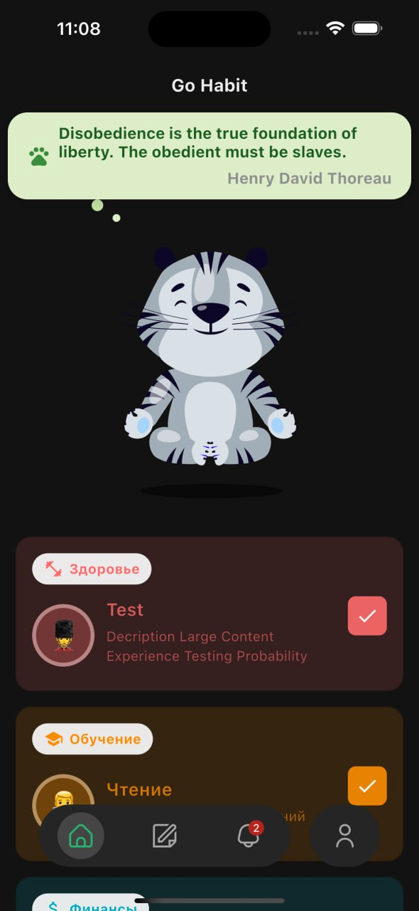
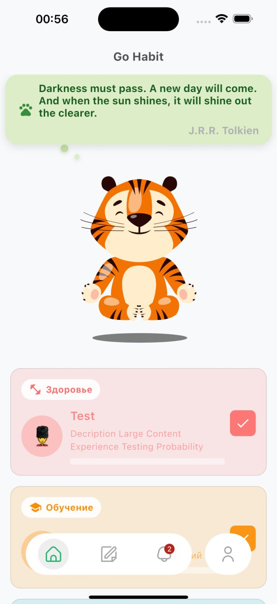
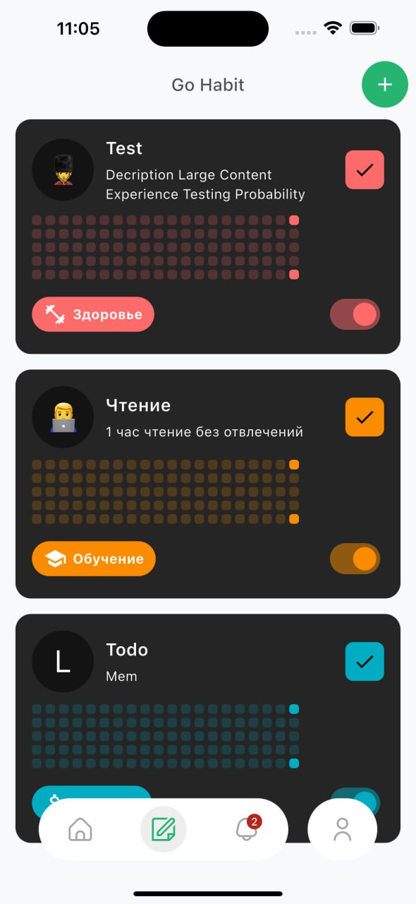
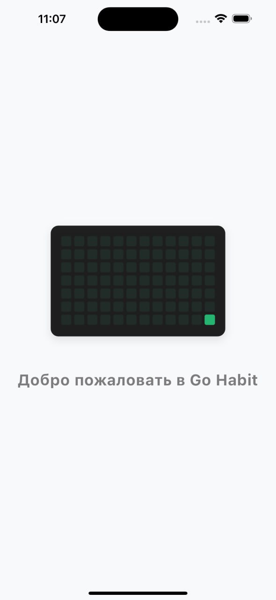
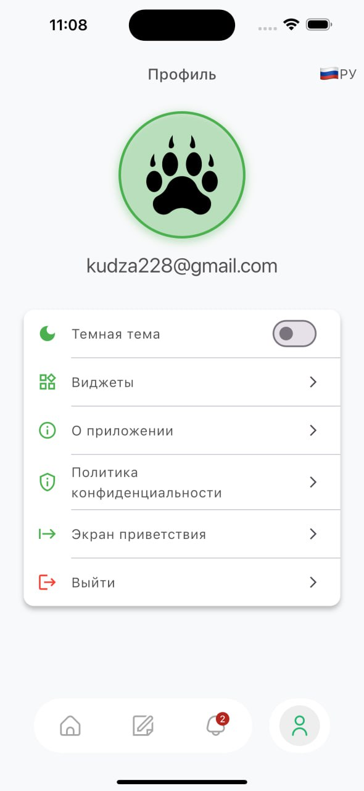
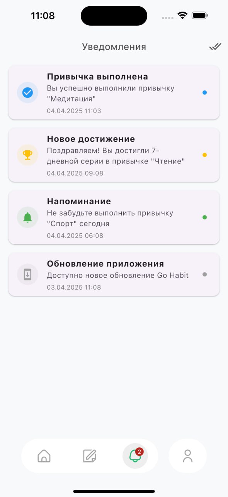

# GoHabit

Мобильное приложение для отслеживания привычек и формирования полезных навыков, разработанное на Flutter.

## Описание проекта

GoHabit — это приложение, которое помогает пользователям создавать, отслеживать и развивать полезные привычки. Пользователи могут создавать категории привычек, устанавливать цели, отслеживать свой прогресс и получать статистику по своим достижениям.

## Технический стек

- **Фреймворк**: Flutter 3.6+
- **Язык программирования**: Dart
- **Архитектура**: Чистая архитектура (Clean Architecture) с использованием BLoC для управления состоянием
- **База данных**: 
  - Локальная: Drift (SQLite)
  - Удаленная: Supabase
- **Навигация**: go_router
- **Локализация**: Поддержка русского и английского языков
- **Тема**: Поддержка переключения темной и светлой темы
- **Управление зависимостями**: yx_scope
- **Анимации**: Lottie

## Основные функции

- Создание и управление привычками
- Категоризация привычек
- Отслеживание прогресса и ведение статистики
- Подсчет серий выполнения (стрики)
- Синхронизация данных с облаком
- Смена темы (светлая/темная)
- Многоязычный интерфейс (русский/английский)
- Пользовательские настройки

## Структура проекта

Проект организован в соответствии с принципами чистой архитектуры:

- **core/** - Ядро приложения, содержащее общие компоненты
  - **database/** - Настройка базы данных Drift и определение таблиц
  - **router/** - Система маршрутизации на основе go_router
  - **resources/** - Ресурсы приложения (изображения, иконки)
  - **theme/** - Настройки темы приложения
  - **environment/** - Конфигурация окружения
  - **services/** - Общие сервисы
  - **ui_kit/** - Общие UI компоненты

- **feature/** - Модули функциональности приложения
  - **auth/** - Аутентификация пользователя
  - **habits/** - Управление привычками
  - **categories/** - Категории привычек
  - **habit_stats/** - Статистика привычек
  - **home/** - Главный экран
  - **profile/** - Профиль пользователя
  - **settings/** - Настройки приложения
  - **language/** - Управление языками
  - **theme/** - Управление темами

- **l10n/** - Файлы локализации

## Установка и использование

Приложение GoHabit доступно для скачивания в разделе Releases на GitHub-репозитории проекта. Вы можете установить последнюю версию, выполнив следующие шаги:

1. Перейдите на страницу релизов: [GitHub Releases](https://github.com/MeZeksan/go_habit/releases)
2. Скачайте последнюю версию APK-файла для Android или IPA для iOS
3. Установите скачанный файл на своё устройство
4. При первом запуске необходимо предоставить приложению требуемые разрешения

## Разработка

### Генерация кода

Проект использует код-генерацию для различных компонентов (БД, JSON-сериализация и т.д.). Для генерации кода выполните:

```bash
flutter pub run build_runner build --delete-conflicting-outputs
```

### Локализация

Для добавления новых строк локализации отредактируйте файлы в директории `lib/l10n/` (app_en.arb, app_ru.arb).

## Тестирование

Проект включает unit и golden тесты. Для запуска тестов выполните:

```bash
flutter test
flutter test --update-goldens
```

## Скриншоты

<div align="center">
  
  
  
</div>

<div align="center">
  
  
  
</div>